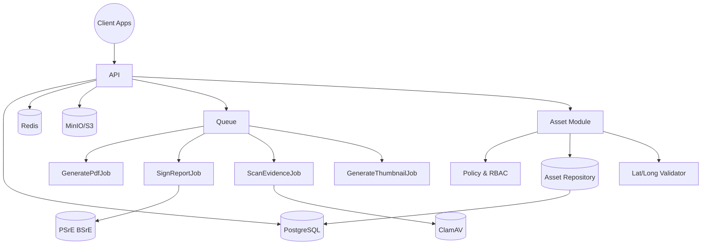

# Arsitektur Backend

## Komponen
- API (Laravel 10 DDD; kompatibel upgrade 11)
- PostgreSQL (data utama)
- MinIO/S3 (object storage evidence & PDF)
- Redis (queue + cache)
- Queue Workers (jobs: PDF, TTE, AV, thumbnail, notify)
- ClamAV (antivirus, opsi TCP 3310)



## Alur Submit → Review → Tanda Tangan
```mermaid

```

## ERD (ringkas)
```mermaid
erDiagram
  users ||--o{ reports : created_by
  units ||--o{ users : has
  reports ||--o{ report_evidences : has
  reports ||--o{ approvals : has
  reports ||--o{ comments : has
  reports ||--|| signatures : has
  users ||--o{ audit_logs : actor
  users ||--o{ asset_loans : borrower
  assets ||--o{ asset_loans : has
  asset_loans }o--|| asset_locations : uses
  assets ||--o{ asset_status_histories : history
  asset_status_histories }o--|| asset_statuses : status

  assets {
    uuid id
    string name
    string code
    enum status
  }
  asset_loans {
    uuid id
    uuid asset_id
    uuid borrower_id
    decimal loan_lat
    decimal loan_long
    timestamp borrowed_at
    timestamp returned_at
  }
  asset_locations {
    uuid id
    uuid asset_loan_id
    decimal lat
    decimal long
    string location_name
  }
  asset_statuses {
    string key
    string label
  }
  asset_status_histories {
    uuid id
    uuid asset_id
    string status_key
    timestamp changed_at
    uuid changed_by
  }
```

## RBAC & Policy
- Role minimal: admin, pelapor, kabid, auditor
- Policy: akses per-unit; kabid dapat review; evidence immutable setelah approved

## Fitur Asset (Alat)
- Modul asset melacak inventaris alat, status enum (`available`, `borrowed`, `maintenance`, `retired`) untuk integrasi RBAC
- Aktivasi dicatat di `asset_loans` dengan metadata opsional koordinat (`loan_lat`, `loan_long`), PIC, catatan, dan nama lokasi
- Detail lokasi tambahan (nama lokasi, koordinat akurat) tersimpan di `asset_locations` guna audit dan pelacakan lapangan ketika koordinat tersedia
- Riwayat perubahan status tercatat di `asset_status_histories` termasuk petugas yang melakukan perubahan
- Hook notifikasi memanfaatkan channel yang sama dengan laporan (email/in-app) agar peminjam dan admin terinformasikan

## Kepatuhan BSrE BSSN
- Only image; EXIF GPS+akurasi wajib (server-validated)
- Hash SHA-256 pada foto & PDF; QR verifikasi pada PDF
- TTE: interface `TteSignerInterface`; adapter mock; ganti ke BSrE
- Simpan OCSP/CRL & TSA metadata dari provider
flowchart LR
  Pelapor((Pelapor)) -->|POST /reports (draft)| API
  Pelapor -->|Presign & unggah bukti| API
  Pelapor -->|Submit laporan| API
  API -->|Kirim notifikasi| Kabid((Kabid))
  Kabid -->|Review & setujui| API
  API -->|Dispatch GeneratePdfJob| Queue[Queue]
  Queue -->|Bangun PDF ringkasan| API
  API -->|Simpan summary.pdf| S3[(S3/MinIO)]
  Queue -->|Dispatch SignReportJob| SignJob[SignReportJob]
  SignJob -->|Kirim permintaan tanda tangan| PSrE[(PSrE)]
  PSrE -->|Kirim signed.pdf + OCSP/CRL/TSA| SignJob
  SignJob -->|Simpan signed.pdf| S3
  API -->|Status approved + metadata tanda tangan| Pelapor
