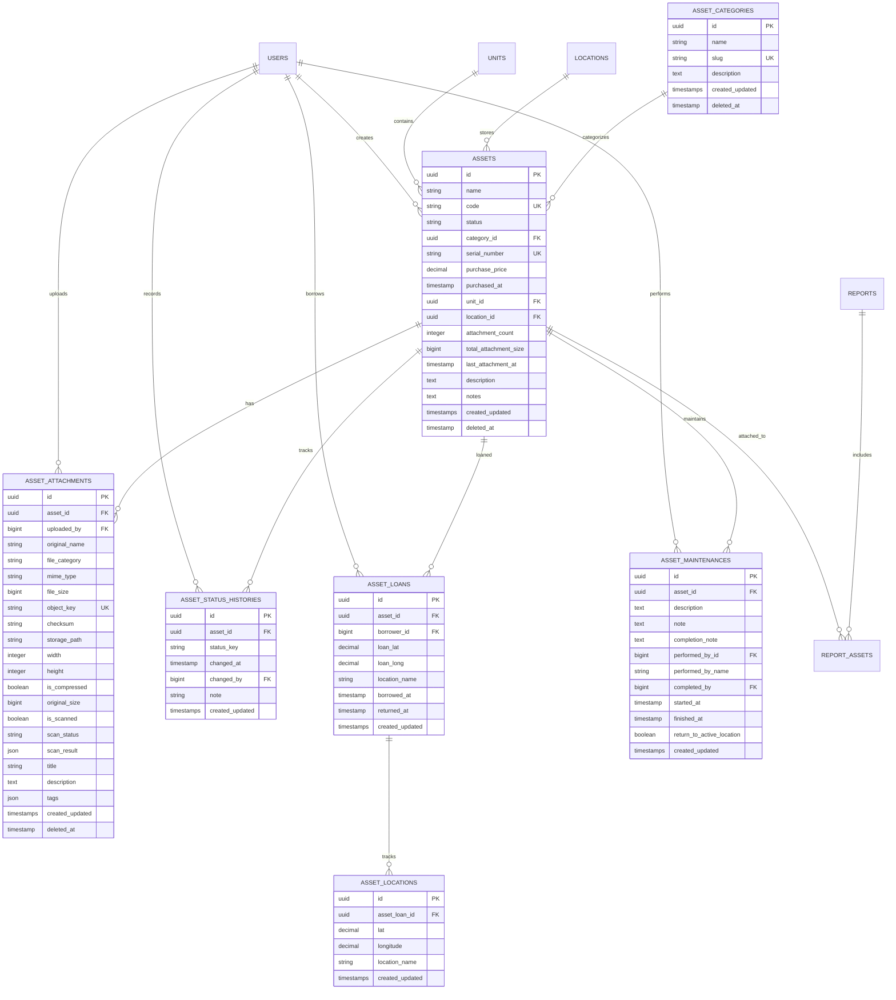

# Asset Management System - Comprehensive Database Design

## Executive Summary

This document outlines a comprehensive database structure for an enhanced asset management system that supports:
- Asset status tracking (active, inactive, maintenance, retired)
- Multiple file uploads per asset with detailed metadata
- Cloud storage integration (S3-compatible)
- Efficient querying and scalability
- Integration with existing system architecture

## Current System Analysis

### Existing Tables
1. **assets** - Core asset information
2. **asset_status_histories** - Status change tracking
3. **asset_categories** - Asset categorization
4. **asset_loans** - Asset borrowing records
5. **asset_locations** - GPS tracking for borrowed assets
6. **asset_maintenances** - Maintenance records
7. **report_assets** - Asset-report relationships

### Current Asset Status Flow
```
Available → Borrowed → Available
Available → Maintenance → Available
Available → Retired (terminal)
Borrowed → Maintenance → Available
```

### Status Enum Values
- `available` - Asset ready for use
- `borrowed` - Asset currently loaned out
- `maintenance` - Asset under maintenance
- `retired` - Asset permanently decommissioned
- `completed` - Maintenance completed status
- `attached` - Asset attached to report

## Enhanced Database Schema

### 1. New Table: `asset_attachments`

This table stores metadata for all files attached to assets, following the pattern established by [`report_evidences`](../database/migrations/2025_09_04_100100_create_reports_and_related_tables.php:33).

```sql
CREATE TABLE asset_attachments (
    -- Primary Key
    id UUID PRIMARY KEY,
    
    -- Foreign Keys
    asset_id UUID NOT NULL,
    uploaded_by BIGINT UNSIGNED NOT NULL,
    
    -- File Metadata
    original_name VARCHAR(255) NOT NULL,
    file_category VARCHAR(100) NULL,  -- User-defined category (e.g., 'manual', 'warranty', 'photo')
    mime_type VARCHAR(100) NOT NULL,
    file_size BIGINT UNSIGNED NOT NULL,  -- Size in bytes
    
    -- Storage Information
    object_key VARCHAR(255) NOT NULL UNIQUE,  -- S3 object key
    checksum VARCHAR(64) NOT NULL,  -- SHA-256 hash for integrity
    storage_path VARCHAR(500) NULL,  -- Full S3 path/URL
    
    -- Image-specific Metadata (nullable for non-images)
    width INTEGER UNSIGNED NULL,
    height INTEGER UNSIGNED NULL,
    is_compressed BOOLEAN DEFAULT FALSE,
    original_size BIGINT UNSIGNED NULL,  -- Original size before compression
    
    -- Security & Validation
    is_scanned BOOLEAN DEFAULT FALSE,
    scan_status VARCHAR(50) NULL,  -- 'clean', 'infected', 'failed', 'pending'
    scan_result JSON NULL,  -- Detailed scan results
    
    -- Descriptive Information
    title VARCHAR(255) NULL,
    description TEXT NULL,
    tags JSON NULL,  -- Flexible tagging system
    
    -- Audit Trail
    created_at TIMESTAMP WITH TIME ZONE NOT NULL,
    updated_at TIMESTAMP WITH TIME ZONE NOT NULL,
    deleted_at TIMESTAMP WITH TIME ZONE NULL,
    
    -- Foreign Key Constraints
    CONSTRAINT fk_asset_attachments_asset 
        FOREIGN KEY (asset_id) 
        REFERENCES assets(id) 
        ON DELETE CASCADE,
    
    CONSTRAINT fk_asset_attachments_uploader 
        FOREIGN KEY (uploaded_by) 
        REFERENCES users(id) 
        ON DELETE RESTRICT,
    
    -- Constraints
    CONSTRAINT chk_file_size 
        CHECK (file_size > 0 AND file_size <= 16777216),  -- Max 16MB
    
    CONSTRAINT chk_scan_status 
        CHECK (scan_status IN ('clean', 'infected', 'failed', 'pending') OR scan_status IS NULL)
);
```

### 2. Enhanced `assets` Table

The existing [`assets`](../database/migrations/2025_09_06_000000_create_assets_domain_tables.php:12) table already has good structure. Recommended additions:

```sql
ALTER TABLE assets ADD COLUMN IF NOT EXISTS (
    -- File Management
    attachment_count INTEGER DEFAULT 0,  -- Denormalized count for performance
    total_attachment_size BIGINT DEFAULT 0,  -- Total size in bytes
    last_attachment_at TIMESTAMP WITH TIME ZONE NULL,
    
    -- Enhanced Metadata
    description TEXT NULL,
    notes TEXT NULL,
    
    -- Constraints
    CONSTRAINT chk_attachment_size 
        CHECK (total_attachment_size >= 0 AND total_attachment_size <= 104857600)  -- Max 100MB total
);
```

### 3. Enhanced `asset_status_histories` Table

The existing [`asset_status_histories`](../database/migrations/2025_09_06_000000_create_assets_domain_tables.php:49) table is well-designed. No changes needed, but ensure proper indexing.

## Entity Relationship Diagram



## Indexing Strategy

### Primary Indexes (Already Exist)
- Primary keys on all tables (UUID v7 for time-ordered benefits)
- Unique constraints on `assets.code`, `assets.serial_number`
- Unique constraint on `asset_attachments.object_key`

### Recommended Additional Indexes

```sql
-- Asset Attachments Table
CREATE INDEX idx_asset_attachments_asset_id 
    ON asset_attachments(asset_id) 
    WHERE deleted_at IS NULL;

CREATE INDEX idx_asset_attachments_uploaded_by 
    ON asset_attachments(uploaded_by);

CREATE INDEX idx_asset_attachments_created_at 
    ON asset_attachments(created_at DESC);

CREATE INDEX idx_asset_attachments_file_category 
    ON asset_attachments(file_category) 
    WHERE file_category IS NOT NULL AND deleted_at IS NULL;

CREATE INDEX idx_asset_attachments_scan_status 
    ON asset_attachments(scan_status) 
    WHERE scan_status IS NOT NULL;

CREATE INDEX idx_asset_attachments_checksum 
    ON asset_attachments(checksum);

-- Composite index for common queries
CREATE INDEX idx_asset_attachments_asset_category 
    ON asset_attachments(asset_id, file_category, created_at DESC) 
    WHERE deleted_at IS NULL;

-- Assets Table (Enhanced)
CREATE INDEX idx_assets_status 
    ON assets(status) 
    WHERE deleted_at IS NULL;

CREATE INDEX idx_assets_category_id 
    ON assets(category_id) 
    WHERE deleted_at IS NULL;

CREATE INDEX idx_assets_unit_id 
    ON assets(unit_id) 
    WHERE deleted_at IS NULL;

CREATE INDEX idx_assets_location_id 
    ON assets(location_id) 
    WHERE deleted_at IS NULL;

CREATE INDEX idx_assets_attachment_count 
    ON assets(attachment_count DESC) 
    WHERE attachment_count > 0 AND deleted_at IS NULL;

-- Full-text search index for asset search
CREATE INDEX idx_assets_search 
    ON assets USING gin(to_tsvector('english', 
        coalesce(name, '') || ' ' || 
        coalesce(code, '') || ' ' || 
        coalesce(serial_number, '') || ' ' || 
        coalesce(description, '')
    ));

-- Asset Status Histories Table
CREATE INDEX idx_asset_status_histories_asset_id 
    ON asset_status_histories(asset_id, changed_at DESC);

CREATE INDEX idx_asset_status_histories_status_key 
    ON asset_status_histories(status_key);

CREATE INDEX idx_asset_status_histories_changed_by 
    ON asset_status_histories(changed_by) 
    WHERE changed_by IS NOT NULL;

-- Asset Loans Table
CREATE INDEX idx_asset_loans_asset_id 
    ON asset_loans(asset_id, borrowed_at DESC);

CREATE INDEX idx_asset_loans_borrower_id 
    ON asset_loans(borrower_id);

CREATE INDEX idx_asset_loans_active 
    ON asset_loans(asset_id) 
    WHERE returned_at IS NULL;

-- Asset Maintenances Table
CREATE INDEX idx_asset_maintenances_asset_id 
    ON asset_maintenances(asset_id, started_at DESC);

CREATE INDEX idx_asset_maintenances_active 
    ON asset_maintenances(asset_id) 
    WHERE finished_at IS NULL;

CREATE INDEX idx_asset_maintenances_performed_by 
    ON asset_maintenances(performed_by_id) 
    WHERE performed_by_id IS NOT NULL;
```

### Index Usage Patterns

1. **Asset Listing with Attachments**
   ```sql
   SELECT a.*, COUNT(aa.id) as attachment_count
   FROM assets a
   LEFT JOIN asset_attachments aa ON a.id = aa.asset_id AND aa.deleted_at IS NULL
   WHERE a.status = 'available' AND a.deleted_at IS NULL
   GROUP BY a.id
   ORDER BY a.created_at DESC;
   ```
   Uses: `idx_assets_status`, `idx_asset_attachments_asset_id`

2. **Asset Search with Files**
   ```sql
   SELECT a.*, aa.original_name, aa.file_category
   FROM assets a
   LEFT JOIN asset_attachments aa ON a.id = aa.asset_id
   WHERE a.name ILIKE '%laptop%' AND a.deleted_at IS NULL
   ORDER BY a.created_at DESC;
   ```
   Uses: `idx_assets_search` (full-text) or table scan with `ILIKE`

3. **File Category Filtering**
   ```sql
   SELECT * FROM asset_attachments
   WHERE asset_id = 'uuid-here' 
     AND file_category = 'warranty'
     AND deleted_at IS NULL
   ORDER BY created_at DESC;
   ```
   Uses: `idx_asset_attachments_asset_category`

## Migration Strategy

### Phase 1: Create New Table
```php
// database/migrations/2025_XX_XX_XXXXXX_create_asset_attachments_table.php
Schema::create('asset_attachments', function (Blueprint $table) {
    $table->uuid('id')->primary();
    $table->foreignUuid('asset_id')->constrained('assets')->cascadeOnDelete();
    $table->foreignId('uploaded_by')->constrained('users')->restrictOnDelete();
    
    // File metadata
    $table->string('original_name');
    $table->string('file_category')->nullable();
    $table->string('mime_type', 100);
    $table->unsignedBigInteger('file_size');
    
    // Storage
    $table->string('object_key')->unique();
    $table->string('checksum', 64);
    $table->string('storage_path', 500)->nullable();
    
    // Image metadata
    $table->unsignedInteger('width')->nullable();
    $table->unsignedInteger('height')->nullable();
    $table->boolean('is_compressed')->default(false);
    $table->unsignedBigInteger('original_size')->nullable();
    
    // Security
    $table->boolean('is_scanned')->default(false);
    $table->string('scan_status', 50)->nullable();
    $table->json('scan_result')->nullable();
    
    // Descriptive
    $table->string('title')->nullable();
    $table->text('description')->nullable();
    $table->json('tags')->nullable();
    
    $table->timestampsTz();
    $table->softDeletesTz();
    
    // Indexes
    $table->index(['asset_id', 'deleted_at']);
    $table->index('uploaded_by');
    $table->index('file_category');
    $table->index('created_at');
    $table->index('checksum');
});
```

### Phase 2: Enhance Assets Table
```php
// database/migrations/2025_XX_XX_XXXXXX_add_attachment_fields_to_assets.php
Schema::table('assets', function (Blueprint $table) {
    $table->integer('attachment_count')->default(0)->after('location_id');
    $table->unsignedBigInteger('total_attachment_size')->default(0)->after('attachment_count');
    $table->timestampTz('last_attachment_at')->nullable()->after('total_attachment_size');
    $table->text('description')->nullable()->after('serial_number');
    $table->text('notes')->nullable()->after('description');
    
    $table->index('attachment_count');
});
```

### Phase 3: Create Indexes
```php
// database/migrations/2025_XX_XX_XXXXXX_add_performance_indexes.php
Schema::table('asset_attachments', function (Blueprint $table) {
    $table->index(['asset_id', 'file_category', 'created_at'], 'idx_asset_attach_composite');
});

Schema::table('assets', function (Blueprint $table) {
    $table->index('status');
    $table->index('category_id');
});

// Add more indexes as defined in indexing strategy
```

## Scalability Considerations

### 1. Storage Optimization

**File Size Management**
- Maximum 16MB per file (compressed if image)
- Maximum 100MB total per asset
- Automatic image compression on backend
- Progressive loading for large file lists

**Cloud Storage Strategy**
- Use S3-compatible storage (following [`report_evidences`](../database/migrations/2025_09_04_100100_create_reports_and_related_tables.php:33) pattern)
- Implement lifecycle policies for old files
- Use CloudFront/CDN for file delivery
- Store thumbnails separately for images

### 2. Database Performance

**Query Optimization**
- Use partial indexes with `WHERE deleted_at IS NULL`
- Implement cursor-based pagination for large result sets
- Use `EXPLAIN ANALYZE` to monitor query performance
- Consider materialized views for complex aggregations

**Denormalization**
- Store `attachment_count` on assets table
- Cache total file sizes to avoid aggregation queries
- Update counters via database triggers or application logic

**Partitioning Strategy** (Future)
```sql
-- Partition by year for historical data
CREATE TABLE asset_attachments_2025 PARTITION OF asset_attachments
    FOR VALUES FROM ('2025-01-01') TO ('2026-01-01');

CREATE TABLE asset_attachments_2026 PARTITION OF asset_attachments
    FOR VALUES FROM ('2026-01-01') TO ('2027-01-01');
```

### 3. Caching Strategy

**Application-Level Caching**
```php
// Cache asset with attachments
Cache::remember("asset:{$assetId}:attachments", 3600, function() use ($assetId) {
    return Asset::with('attachments')->find($assetId);
});

// Cache attachment counts
Cache::remember("asset:{$assetId}:attachment_count", 3600, function() use ($assetId) {
    return AssetAttachment::where('asset_id', $assetId)->count();
});
```

**Database Query Caching**
- Use Redis for frequently accessed data
- Implement cache invalidation on updates
- Cache file metadata separately from file content

### 4. Concurrent Access Handling

**Optimistic Locking**
```php
// Add version column to assets table
Schema::table('assets', function (Blueprint $table) {
    $table->unsignedBigInteger('version')->default(0);
});

// Update with version check
DB::table('assets')
    ->where('id', $assetId)
    ->where('version', $currentVersion)
    ->update([
        'attachment_count' => $newCount,
        'version' => $currentVersion + 1
    ]);
```

**File Upload Queuing**
- Process virus scanning asynchronously
- Use job queues for image compression
- Implement upload progress tracking

### 5. Monitoring & Maintenance

**Key Metrics to Track**
- Average file size per asset
- Total storage usage per unit/category
- Upload success/failure rates
- Virus scan results
- Query performance (slow query log)
- Storage costs

**Maintenance Tasks**
```sql
-- Clean up orphaned files (soft-deleted > 30 days)
DELETE FROM asset_attachments 
WHERE deleted_at < NOW() - INTERVAL '30 days';

-- Vacuum and analyze tables regularly
VACUUM ANALYZE asset_attachments;
VACUUM ANALYZE assets;

-- Monitor table bloat
SELECT schemaname, tablename, 
       pg_size_pretty(pg_total_relation_size(schemaname||'.'||tablename)) AS size
FROM pg_tables 
WHERE tablename LIKE 'asset%'
ORDER BY pg_total_relation_size(schemaname||'.'||tablename) DESC;
```

### 6. Backup & Recovery

**Backup Strategy**
- Daily full database backups
- Separate S3 bucket versioning for files
- Point-in-time recovery capability
- Test restore procedures monthly

**Disaster Recovery**
- Multi-region S3 replication
- Database read replicas
- Automated failover procedures

## Data Integrity & Validation

### Application-Level Validations

```php
// File upload validation rules
$rules = [
    'file' => [
        'required',
        'file',
        'max:16384', // 16MB in KB
        'mimes:jpeg,jpg,png,webp,pdf,doc,docx',
    ],
    'file_category' => 'nullable|string|max:100',
    'title' => 'nullable|string|max:255',
    'description' => 'nullable|string|max:5000',
];

// Asset attachment limit check
if ($asset->attachment_count >= 50) {
    throw new ValidationException('Maximum 50 attachments per asset');
}

if ($asset->total_attachment_size + $fileSize > 104857600) {
    throw new ValidationException('Total attachment size exceeds 100MB limit');
}
```

### Database Constraints

```sql
-- Ensure file size is within limits
ALTER TABLE asset_attachments 
ADD CONSTRAINT chk_file_size_limit 
CHECK (file_size > 0 AND file_size <= 16777216);

-- Ensure total asset attachment size
ALTER TABLE assets 
ADD CONSTRAINT chk_total_attachment_size 
CHECK (total_attachment_size >= 0 AND total_attachment_size <= 104857600);

-- Ensure valid scan status
ALTER TABLE asset_attachments 
ADD CONSTRAINT chk_valid_scan_status 
CHECK (scan_status IN ('clean', 'infected', 'failed', 'pending') OR scan_status IS NULL);
```

### Referential Integrity

All foreign keys use appropriate cascade rules:
- `ON DELETE CASCADE` for asset_attachments → assets (files deleted with asset)
- `ON DELETE RESTRICT` for asset_attachments → users (prevent user deletion if they uploaded files)
- `ON DELETE SET NULL` for assets → locations (preserve asset if location deleted)

## Security Considerations

### 1. File Access Control

**Permission-Based Access**
- Reuse existing `view-asset` permission
- Users with asset view permission can see attachments
- Implement signed URLs for S3 access (time-limited)

```php
// Generate signed URL for file download
$url = Storage::disk('s3')->temporaryUrl(
    $attachment->object_key,
    now()->addMinutes(5)
);
```

### 2. Virus Scanning

**Integration with ClamAV or Cloud Scanner**
```php
// Queue virus scan after upload
dispatch(new ScanAssetAttachment($attachment));

// Update scan status
$attachment->update([
    'is_scanned' => true,
    'scan_status' => 'clean', // or 'infected'
    'scan_result' => $scanDetails,
]);
```

### 3. File Validation

**MIME Type Verification**
- Verify actual file content matches declared MIME type
- Use `finfo_file()` for server-side validation
- Reject executable files and scripts

**Checksum Verification**
```php
// Calculate SHA-256 checksum
$checksum = hash_file('sha256', $file->path());

// Prevent duplicate uploads
if (AssetAttachment::where('checksum', $checksum)->exists()) {
    throw new ValidationException('File already uploaded');
}
```

## API Design Recommendations

### Endpoints

```
POST   /api/v1/assets/{assetId}/attachments          - Upload file
GET    /api/v1/assets/{assetId}/attachments          - List files
GET    /api/v1/assets/{assetId}/attachments/{id}     - Get file details
DELETE /api/v1/assets/{assetId}/attachments/{id}     - Delete file
PATCH  /api/v1/assets/{assetId}/attachments/{id}     - Update metadata
GET    /api/v1/assets/{assetId}/attachments/{id}/download - Download file
```

### Response Format

```json
{
  "data": {
    "id": "01JGXXX-XXXX-XXXX-XXXX-XXXXXXXXXXXX",
    "asset_id": "01JGYYY-YYYY-YYYY-YYYY-YYYYYYYYYYYY",
    "original_name": "laptop-warranty.pdf",
    "file_category": "warranty",
    "mime_type": "application/pdf",
    "file_size": 2457600,
    "title": "Dell Laptop Warranty Certificate",
    "description": "3-year warranty valid until 2027",
    "is_compressed": false,
    "is_scanned": true,
    "scan_status": "clean",
    "uploaded_by": {
      "id": 1,
      "name": "John Doe"
    },
    "created_at": "2025-12-31T10:30:00Z",
    "download_url": "https://cdn.example.com/signed-url..."
  }
}
```

## Implementation Checklist

- [ ] Create `asset_attachments` table migration
- [ ] Add attachment fields to `assets` table
- [ ] Create all recommended indexes
- [ ] Implement Eloquent models and relationships
- [ ] Create file upload service with validation
- [ ] Implement image compression service
- [ ] Set up virus scanning integration
- [ ] Create API controllers and routes
- [ ] Implement file download with signed URLs
- [ ] Add attachment count update triggers/observers
- [ ] Create unit tests for file operations
- [ ] Set up S3 bucket and lifecycle policies
- [ ] Configure CDN for file delivery
- [ ] Implement caching strategy
- [ ] Add monitoring and logging
- [ ] Create API documentation
- [ ] Perform load testing
- [ ] Set up backup procedures

## Conclusion

This database design provides a robust, scalable foundation for asset file management that:

✅ Supports multiple file types (images, PDFs, documents)
✅ Integrates with existing cloud storage infrastructure
✅ Maintains data integrity through proper constraints
✅ Optimizes query performance with strategic indexing
✅ Scales efficiently with denormalization and caching
✅ Ensures security through validation and scanning
✅ Follows existing system patterns and conventions

The design is production-ready and can handle thousands of assets with multiple attachments while maintaining fast query performance and data consistency.