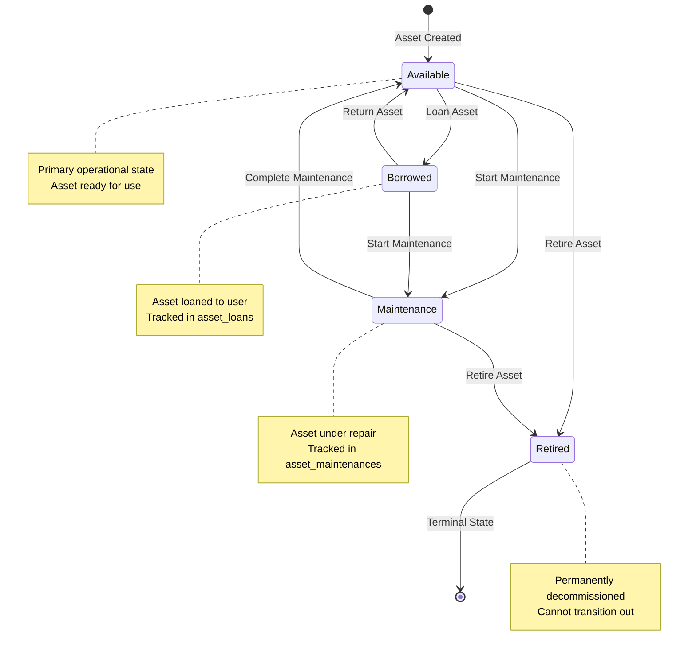

# Asset Status Tracking Architecture Analysis

## Executive Summary

This document provides a comprehensive analysis of status tracking approaches for the asset management system, comparing the current unified status approach against a multi-column status architecture. It examines the existing implementation, evaluates trade-offs, and provides detailed recommendations.

## Current System Analysis

### Existing Status Implementation

The current system uses a **unified status approach** with a single `status` column in the [`assets`](../database/migrations/2025_09_06_000000_create_assets_domain_tables.php:12) table:

```sql
CREATE TABLE assets (
    id UUID PRIMARY KEY,
    name VARCHAR(255),
    code VARCHAR(255) UNIQUE,
    status VARCHAR(255) DEFAULT 'available',  -- Single unified status
    -- ... other fields
);
```

### Current Status Values (from [`AssetStatus`](../src/Domain/Asset/Enums/AssetStatus.php:5) enum)

```php
enum AssetStatus: string
{
    case Available = 'available';      // Ready for use
    case Borrowed = 'borrowed';        // Currently loaned out
    case Maintenance = 'maintenance';  // Under maintenance
    case Retired = 'retired';          // Permanently decommissioned
    case Completed = 'completed';      // Maintenance completed
    case Attached = 'attached';        // Attached to report
}
```

### Status Transition Rules

```php
public function canTransitionTo(self $next): bool
{
    return match ($this) {
        self::Available => in_array($next, [self::Borrowed, self::Maintenance, self::Retired]),
        self::Borrowed => in_array($next, [self::Available, self::Maintenance]),
        self::Maintenance => in_array($next, [self::Available, self::Retired]),
        self::Retired => $next === self::Retired,  // Terminal state
        self::Completed => $next === self::Completed,
        self::Attached => $next === self::Attached
    };
}
```

### Status State Machine Diagram



## Problem Statement

The current unified status approach has limitations when tracking multiple orthogonal status dimensions:

1. **Lifecycle Status**: Where is the asset in its lifecycle? (available, borrowed, retired)
2. **Maintenance Status**: Is the asset under maintenance? (maintenance, not_maintenance)
3. **Operational Status**: Can the asset be used? (active, inactive)
4. **Report Status**: Is the asset attached to a report? (attached, not_attached)

### Current System Limitations

**Issue 1: Status Conflicts**
```
Question: Can an asset be "borrowed" AND "under maintenance" simultaneously?
Current System: NO - only one status allowed
Reality: YES - a borrowed asset might need maintenance
```

**Issue 2: Lost Information**
```
Scenario: Asset is borrowed, then needs maintenance
Current: borrowed → maintenance (lost "borrowed" state)
Problem: When maintenance completes, should it return to "borrowed" or "available"?
```

**Issue 3: Complex State Management**
```php
// Current workaround in CompleteAssetMaintenanceService
if ($maintenance->return_to_active_location) {
    // Try to restore previous state
    // But previous state is lost!
}
```

## Architecture Options

### Option 1: Unified Status (Current Approach)

**Structure:**
```sql
CREATE TABLE assets (
    id UUID PRIMARY KEY,
    status VARCHAR(255) DEFAULT 'available',  -- Single status field
    -- Supporting tables track additional context
);
```

**Advantages:**
✅ Simple to understand and query
✅ Single source of truth for asset state
✅ Easy to enforce business rules via enum
✅ Straightforward UI representation
✅ Minimal database changes

**Disadvantages:**
❌ Cannot represent multiple concurrent states
❌ Loses previous state information during transitions
❌ Complex logic to restore previous states
❌ Limited flexibility for new status dimensions
❌ Requires workarounds (like `return_to_active_location` flag)

**Current Implementation Pattern:**
```php
// Status stored in single column
$asset->status = AssetStatus::Maintenance;

// Context stored in related tables
$maintenance = AssetMaintenance::create([
    'asset_id' => $asset->id,
    'return_to_active_location' => true,  // Workaround to remember previous state
]);
```

### Option 2: Multi-Column Status (Separate Dimensions)

**Structure:**
```sql
CREATE TABLE assets (
    id UUID PRIMARY KEY,
    
    -- Lifecycle status (mutually exclusive)
    lifecycle_status VARCHAR(50) DEFAULT 'available',
    -- Values: 'available', 'borrowed', 'retired'
    
    -- Maintenance status (independent)
    is_under_maintenance BOOLEAN DEFAULT FALSE,
    
    -- Operational status (independent)
    is_active BOOLEAN DEFAULT TRUE,
    
    -- Report attachment status (independent)
    is_attached_to_report BOOLEAN DEFAULT FALSE,
    
    -- Timestamps for each dimension
    lifecycle_status_changed_at TIMESTAMP,
    maintenance_status_changed_at TIMESTAMP,
    operational_status_changed_at TIMESTAMP,
    
    -- Previous state tracking
    previous_lifecycle_status VARCHAR(50),
);
```

**Advantages:**
✅ Can represent multiple concurrent states
✅ Clear separation of concerns
✅ Preserves state information during transitions
✅ Flexible - easy to add new status dimensions
✅ More accurate representation of reality
✅ Simpler restoration logic

**Disadvantages:**
❌ More complex queries (multiple columns to check)
❌ Potential for inconsistent states
❌ More columns to maintain
❌ Requires careful constraint management
❌ More complex UI representation

**Implementation Pattern:**
```php
// Multiple independent status dimensions
$asset->lifecycle_status = 'borrowed';
$asset->is_under_maintenance = true;  // Can be both!
$asset->is_active = true;

// Query becomes more complex
Asset::where('lifecycle_status', 'borrowed')
    ->where('is_under_maintenance', false)
    ->where('is_active', true)
    ->get();
```

### Option 3: Hybrid Approach (Recommended)

**Structure:**
```sql
CREATE TABLE assets (
    id UUID PRIMARY KEY,
    
    -- Primary status (for simple queries and UI)
    status VARCHAR(50) DEFAULT 'available',
    -- Values: 'available', 'borrowed', 'maintenance', 'retired'
    
    -- Independent flags for orthogonal concerns
    is_under_maintenance BOOLEAN DEFAULT FALSE,
    is_active BOOLEAN DEFAULT TRUE,
    
    -- State restoration
    status_before_maintenance VARCHAR(50),
    
    -- Metadata
    status_changed_at TIMESTAMP,
    maintenance_started_at TIMESTAMP,
);

-- Computed/derived status via database view
CREATE VIEW asset_effective_status AS
SELECT 
    id,
    CASE 
        WHEN status = 'retired' THEN 'retired'
        WHEN is_under_maintenance THEN 'maintenance'
        WHEN status = 'borrowed' THEN 'borrowed'
        WHEN is_active THEN 'available'
        ELSE 'inactive'
    END as effective_status,
    status as lifecycle_status,
    is_under_maintenance,
    is_active
FROM assets;
```

**Advantages:**
✅ Maintains simple primary status for common queries
✅ Supports concurrent states via flags
✅ Preserves state information
✅ Backward compatible with existing code
✅ Flexible for future extensions
✅ Clear priority hierarchy

**Disadvantages:**
⚠️ Requires careful synchronization between status and flags
⚠️ Slightly more complex than pure unified approach
⚠️ Need to maintain consistency rules

## Detailed Comparison

### Query Complexity

**Unified Status:**
```sql
-- Simple: Find all available assets
SELECT * FROM assets WHERE status = 'available';

-- Complex: Find borrowed assets not under maintenance
-- IMPOSSIBLE with current schema!
```

**Multi-Column:**
```sql
-- Simple: Find all available assets
SELECT * FROM assets 
WHERE lifecycle_status = 'available' 
  AND is_under_maintenance = FALSE
  AND is_active = TRUE;

-- Complex: Find borrowed assets not under maintenance
SELECT * FROM assets 
WHERE lifecycle_status = 'borrowed' 
  AND is_under_maintenance = FALSE;
```

**Hybrid:**
```sql
-- Simple: Find all available assets (uses primary status)
SELECT * FROM assets WHERE status = 'available';

-- Complex: Find borrowed assets not under maintenance
SELECT * FROM assets 
WHERE status = 'borrowed' 
  AND is_under_maintenance = FALSE;

-- Or use view for computed status
SELECT * FROM asset_effective_status 
WHERE effective_status = 'borrowed';
```

### State Transition Logic

**Unified Status:**
```php
// Starting maintenance on borrowed asset
$asset->status = AssetStatus::Maintenance;  // Lost "borrowed" state!

// Completing maintenance
$asset->status = AssetStatus::Available;  // Wrong! Should return to "borrowed"

// Workaround needed
if ($maintenance->return_to_active_location) {
    // Complex logic to determine previous state
}
```

**Multi-Column:**
```php
// Starting maintenance on borrowed asset
$asset->is_under_maintenance = true;  // Keeps lifecycle_status = 'borrowed'

// Completing maintenance
$asset->is_under_maintenance = false;  // Automatically returns to 'borrowed'
```

**Hybrid:**
```php
// Starting maintenance on borrowed asset
$asset->status_before_maintenance = $asset->status;  // Save current state
$asset->status = AssetStatus::Maintenance;
$asset->is_under_maintenance = true;

// Completing maintenance
$asset->status = $asset->status_before_maintenance ?? AssetStatus::Available;
$asset->is_under_maintenance = false;
$asset->status_before_maintenance = null;
```

### Business Rules Enforcement

**Unified Status:**
```php
// Enforced via enum transitions
if (!$asset->status->canTransitionTo($newStatus)) {
    throw new InvalidArgumentException('Invalid status transition');
}
```

**Multi-Column:**
```php
// Requires custom validation for each dimension
if ($asset->lifecycle_status === 'retired' && $newLifecycleStatus !== 'retired') {
    throw new InvalidArgumentException('Cannot change retired asset lifecycle');
}

if ($asset->lifecycle_status === 'retired' && $isUnderMaintenance) {
    throw new InvalidArgumentException('Cannot maintain retired asset');
}
```

**Hybrid:**
```php
// Combines both approaches
if (!$asset->status->canTransitionTo($newStatus)) {
    throw new InvalidArgumentException('Invalid status transition');
}

// Additional flag validations
if ($asset->status === AssetStatus::Retired && $isUnderMaintenance) {
    throw new InvalidArgumentException('Cannot maintain retired asset');
}
```

## Real-World Scenarios Analysis

### Scenario 1: Borrowed Asset Needs Maintenance

**Current System (Unified):**
```
1. Asset status: borrowed
2. Start maintenance: status → maintenance (LOST borrowed state)
3. Complete maintenance: status → available (WRONG! Should be borrowed)
4. Workaround: Store return_to_active_location flag
5. Complex logic to restore correct state
```

**Multi-Column:**
```
1. Asset: lifecycle_status=borrowed, is_under_maintenance=false
2. Start maintenance: is_under_maintenance=true (keeps lifecycle_status=borrowed)
3. Complete maintenance: is_under_maintenance=false (still borrowed)
4. Return asset: lifecycle_status=available
```

**Hybrid:**
```
1. Asset: status=borrowed, is_under_maintenance=false
2. Start maintenance: 
   - status_before_maintenance=borrowed
   - status=maintenance
   - is_under_maintenance=true
3. Complete maintenance:
   - status=borrowed (from status_before_maintenance)
   - is_under_maintenance=false
4. Return asset: status=available
```

### Scenario 2: Temporarily Deactivate Asset

**Current System:**
```
Problem: No "inactive" status in enum
Workaround: Use maintenance status? Create new status?
Issue: Conflates different concepts
```

**Multi-Column:**
```
Solution: Set is_active=false
Benefit: Keeps lifecycle_status unchanged
Query: WHERE is_active=true
```

**Hybrid:**
```
Solution: Set is_active=false, keep status unchanged
Query: WHERE status != 'retired' AND is_active=true
View: effective_status shows 'inactive'
```

### Scenario 3: Asset Attached to Report While Borrowed

**Current System:**
```
Problem: Cannot be both 'borrowed' and 'attached'
Current: Uses separate report_assets pivot table
Issue: Status doesn't reflect report attachment
```

**Multi-Column:**
```
Solution: 
- lifecycle_status=borrowed
- is_attached_to_report=true
Both states coexist naturally
```

**Hybrid:**
```
Solution:
- status=borrowed (primary)
- Track attachment in report_assets table
- Optional: Add is_attached flag for quick queries
```

## Recommended Approach: Enhanced Hybrid

### Proposed Schema

```sql
CREATE TABLE assets (
    -- Identity
    id UUID PRIMARY KEY,
    name VARCHAR(255) NOT NULL,
    code VARCHAR(255) UNIQUE NOT NULL,
    serial_number VARCHAR(255) UNIQUE,
    
    -- Primary Status (for backward compatibility and simple queries)
    status VARCHAR(50) DEFAULT 'available' NOT NULL,
    -- Values: 'available', 'borrowed', 'maintenance', 'retired'
    
    -- Independent Status Flags
    is_under_maintenance BOOLEAN DEFAULT FALSE NOT NULL,
    is_active BOOLEAN DEFAULT TRUE NOT NULL,
    
    -- State Restoration
    status_before_maintenance VARCHAR(50),
    
    -- Categorization
    category_id UUID,
    unit_id UUID,
    location_id UUID,
    
    -- Financial
    purchase_price DECIMAL(15,2),
    purchased_at TIMESTAMP WITH TIME ZONE,
    
    -- File Management
    attachment_count INTEGER DEFAULT 0,
    total_attachment_size BIGINT DEFAULT 0,
    last_attachment_at TIMESTAMP WITH TIME ZONE,
    
    -- Descriptive
    description TEXT,
    notes TEXT,
    
    -- Status Timestamps
    status_changed_at TIMESTAMP WITH TIME ZONE,
    maintenance_started_at TIMESTAMP WITH TIME ZONE,
    activated_at TIMESTAMP WITH TIME ZONE,
    retired_at TIMESTAMP WITH TIME ZONE,
    
    -- Audit
    created_at TIMESTAMP WITH TIME ZONE NOT NULL,
    updated_at TIMESTAMP WITH TIME ZONE NOT NULL,
    deleted_at TIMESTAMP WITH TIME ZONE,
    
    -- Constraints
    CONSTRAINT chk_valid_status 
        CHECK (status IN ('available', 'borrowed', 'maintenance', 'retired')),
    
    CONSTRAINT chk_retired_immutable 
        CHECK (status != 'retired' OR (
            is_under_maintenance = FALSE AND 
            is_active = FALSE
        )),
    
    CONSTRAINT chk_maintenance_flag_consistency
        CHECK (
            (status = 'maintenance' AND is_under_maintenance = TRUE) OR
            (status != 'maintenance')
        ),
    
    -- Foreign Keys
    FOREIGN KEY (category_id) REFERENCES asset_categories(id),
    FOREIGN KEY (unit_id) REFERENCES units(id),
    FOREIGN KEY (location_id) REFERENCES locations(id) ON DELETE SET NULL
);
```

### Database View for Computed Status

```sql
CREATE VIEW asset_status_view AS
SELECT 
    a.id,
    a.name,
    a.code,
    a.status as primary_status,
    a.is_under_maintenance,
    a.is_active,
    
    -- Computed effective status with priority
    CASE 
        WHEN a.status = 'retired' THEN 'retired'
        WHEN a.is_under_maintenance THEN 'maintenance'
        WHEN a.status = 'borrowed' THEN 'borrowed'
        WHEN NOT a.is_active THEN 'inactive'
        WHEN a.status = 'available' THEN 'available'
        ELSE a.status
    END as effective_status,
    
    -- Status descriptions
    CASE 
        WHEN a.status = 'retired' THEN 'Permanently retired'
        WHEN a.is_under_maintenance AND a.status = 'borrowed' THEN 'Borrowed (under maintenance)'
        WHEN a.is_under_maintenance THEN 'Under maintenance'
        WHEN a.status = 'borrowed' THEN 'Currently borrowed'
        WHEN NOT a.is_active THEN 'Temporarily inactive'
        WHEN a.status = 'available' THEN 'Available for use'
        ELSE 'Unknown status'
    END as status_description,
    
    -- Availability flags
    (a.status = 'available' AND a.is_active AND NOT a.is_under_maintenance) as is_available_for_loan,
    (a.status != 'retired') as is_modifiable,
    
    -- Current loan info
    al.id as current_loan_id,
    al.borrower_id as current_borrower_id,
    
    -- Current maintenance info
    am.id as current_maintenance_id,
    am.performed_by_id as maintenance_performer_id,
    
    a.created_at,
    a.updated_at
FROM assets a
LEFT JOIN asset_loans al ON a.id = al.asset_id AND al.returned_at IS NULL
LEFT JOIN asset_maintenances am ON a.id = am.asset_id AND am.finished_at IS NULL
WHERE a.deleted_at IS NULL;
```

### Enhanced Status History Tracking

```sql
-- Keep existing asset_status_histories table but enhance it
ALTER TABLE asset_status_histories ADD COLUMN IF NOT EXISTS (
    -- Track which dimension changed
    status_dimension VARCHAR(50) NOT NULL DEFAULT 'primary',
    -- Values: 'primary', 'maintenance', 'active', 'lifecycle'
    
    -- Previous and new values
    previous_value VARCHAR(100),
    new_value VARCHAR(100) NOT NULL,
    
    -- Additional context
    metadata JSON,
    
    -- Make status_key more flexible
    ALTER COLUMN status_key TYPE VARCHAR(100)
);

-- Index for querying history by dimension
CREATE INDEX idx_status_histories_dimension 
    ON asset_status_histories(asset_id, status_dimension, changed_at DESC);
```

## Migration Strategy

### Phase 1: Add New Columns (Non-Breaking)

```php
// Migration: 2025_XX_XX_add_status_flags_to_assets.php
public function up(): void
{
    Schema::table('assets', function (Blueprint $table) {
        // Add new columns with defaults
        $table->boolean('is_under_maintenance')->default(false)->after('status');
        $table->boolean('is_active')->default(true)->after('is_under_maintenance');
        $table->string('status_before_maintenance', 50)->nullable()->after('is_active');
        
        // Add timestamps
        $table->timestampTz('status_changed_at')->nullable()->after('status_before_maintenance');
        $table->timestampTz('maintenance_started_at')->nullable()->after('status_changed_at');
        $table->timestampTz('activated_at')->nullable()->after('maintenance_started_at');
        $table->timestampTz('retired_at')->nullable()->after('activated_at');
        
        // Add indexes
        $table->index(['status', 'is_under_maintenance', 'is_active'], 'idx_asset_status_composite');
        $table->index('is_under_maintenance');
        $table->index('is_active');
    });
}
```

### Phase 2: Migrate Existing Data

```php
// Migration: 2025_XX_XX_migrate_asset_status_data.php
public function up(): void
{
    DB::transaction(function () {
        // Set is_under_maintenance based on current status
        DB::table('assets')
            ->where('status', 'maintenance')
            ->update([
                'is_under_maintenance' => true,
                'maintenance_started_at' => DB::raw('updated_at')
            ]);
        
        // Set retired_at for retired assets
        DB::table('assets')
            ->where('status', 'retired')
            ->update([
                'is_active' => false,
                'retired_at' => DB::raw('updated_at')
            ]);
        
        // Set status_changed_at from updated_at
        DB::table('assets')
            ->whereNull('status_changed_at')
            ->update(['status_changed_at' => DB::raw('updated_at')]);
    });
}
```

### Phase 3: Create Database View

```php
// Migration: 2025_XX_XX_create_asset_status_view.php
public function up(): void
{
    DB::statement('
        CREATE VIEW asset_status_view AS
        SELECT 
            a.id,
            a.name,
            a.code,
            a.status as primary_status,
            a.is_under_maintenance,
            a.is_active,
            CASE 
                WHEN a.status = \'retired\' THEN \'retired\'
                WHEN a.is_under_maintenance THEN \'maintenance\'
                WHEN a.status = \'borrowed\' THEN \'borrowed\'
                WHEN NOT a.is_active THEN \'inactive\'
                WHEN a.status = \'available\' THEN \'available\'
                ELSE a.status
            END as effective_status,
            (a.status = \'available\' AND a.is_active AND NOT a.is_under_maintenance) as is_available_for_loan,
            (a.status != \'retired\') as is_modifiable,
            a.created_at,
            a.updated_at
        FROM assets a
        WHERE a.deleted_at IS NULL
    ');
}

public function down(): void
{
    DB::statement('DROP VIEW IF EXISTS asset_status_view');
}
```

### Phase 4: Update Application Code

```php
// Update AssetStatus enum to support new approach
enum AssetStatus: string
{
    case Available = 'available';
    case Borrowed = 'borrowed';
    case Maintenance = 'maintenance';
    case Retired = 'retired';
    
    public function canTransitionTo(self $next, bool $isUnderMaintenance = false): bool
    {
        // Retired is terminal
        if ($this === self::Retired) {
            return $next === self::Retired;
        }
        
        // Cannot retire if under maintenance
        if ($next === self::Retired && $isUnderMaintenance) {
            return false;
        }
        
        return match ($this) {
            self::Available => in_array($next, [self::Borrowed, self::Maintenance, self::Retired]),
            self::Borrowed => in_array($next, [self::Available, self::Maintenance]),
            self::Maintenance => in_array($next, [self::Available, self::Retired]),
            self::Retired => false,
        };
    }
}

// Update Asset entity
class Asset
{
    public function __construct(
        public readonly string $id,
        public string $name,
        public string $code,
        public AssetStatus $status,
        public bool $isUnderMaintenance = false,
        public bool $isActive = true,
        public ?string $statusBeforeMaintenance = null,
        // ... other fields
    ) {}
    
    public function getEffectiveStatus(): string
    {
        if ($this->status === AssetStatus::Retired) {
            return 'retired';
        }
        if ($this->isUnderMaintenance) {
            return 'maintenance';
        }
        if ($this->status === AssetStatus::Borrowed) {
            return 'borrowed';
        }
        if (!$this->isActive) {
            return 'inactive';
        }
        return 'available';
    }
    
    public function isAvailableForLoan(): bool
    {
        return $this->status === AssetStatus::Available 
            && $this->isActive 
            && !$this->isUnderMaintenance;
    }
    
    public function canBeModified(): bool
    {
        return $this->status !== AssetStatus::Retired;
    }
}
```

### Phase 5: Update Services

```php
// Updated MarkAssetMaintenanceService
class MarkAssetMaintenanceService
{
    public function startMaintenance(string $assetId, array $data): void
    {
        $asset = $this->assets->findOrFail($assetId);
        
        // Validate transition
        if (!$asset->status->canTransitionTo(AssetStatus::Maintenance, $asset->isUnderMaintenance)) {
            throw new InvalidArgumentException('Cannot start maintenance');
        }
        
        // Save current status before changing
        $statusBeforeMaintenance = $asset->status->value;
        
        // Update asset
        $this->assets->update($assetId, [
            'status' => AssetStatus::Maintenance,
            'is_under_maintenance' => true,
            'status_before_maintenance' => $statusBeforeMaintenance,
            'maintenance_started_at' => CarbonImmutable::now(),
        ]);
        
        // Create maintenance record
        $maintenance = new AssetMaintenance(/* ... */);
        $this->maintenances->save($maintenance);
        
        // Record history
        $this->statusHistories->record(new AssetStatusHistory(
            id: (string) Uuid::uuid7(),
            assetId: $assetId,
            status: AssetStatus::Maintenance,
            changedAt: CarbonImmutable::now(),
            changedBy: $data['performed_by_id'],
            note: 'Maintenance started: ' . $data['description'],
        ));
    }
    
    public function completeMaintenance(string $assetId, array $data): void
    {
        $asset = $this->assets->findOrFail($assetId);
        $maintenance = $this->maintenances->findActiveByAsset($assetId);
        
        if (!$maintenance || !$asset->isUnderMaintenance) {
            throw new InvalidArgumentException('No active maintenance');
        }
        
        // Restore previous status
        $restoredStatus = $asset->statusBeforeMaintenance 
            ? AssetStatus::from($asset->statusBeforeMaintenance)
            : AssetStatus::Available;
        
        // Update asset
        $this->assets->update($assetId, [
            'status' => $restoredStatus,
            'is_under_maintenance' => false,
            'status_before_maintenance' => null,
            'maintenance_started_at' => null,
        ]);
        
        // Complete maintenance record
        $maintenance->finishedAt = CarbonImmutable::now();
        $maintenance->completionNote = $data['completion_note'];
        $this->maintenances->save($maintenance);
        
        // Record history
        $this->statusHistories->record(new AssetStatusHistory(
            id: (string) Uuid::uuid7(),
            assetId: $assetId,
            status: $restoredStatus,
            changedAt: CarbonImmutable::now(),
            changedBy: $data['completed_by'],
            note: 'Maintenance completed. Restored to: ' . $restoredStatus->value,
        ));
    }
}
```

## Comparison Summary Table

| Aspect | Unified Status | Multi-Column | Hybrid (Recommended) |
|--------|---------------|--------------|---------------------|
| **Simplicity** | ⭐⭐⭐⭐⭐ | ⭐⭐ | ⭐⭐⭐⭐ |
| **Flexibility** | ⭐⭐ | ⭐⭐⭐⭐⭐ | ⭐⭐⭐⭐ |
| **Query Performance** | ⭐⭐⭐⭐⭐ | ⭐⭐⭐ | ⭐⭐⭐⭐ |
| **State Preservation** | ⭐ | ⭐⭐⭐⭐⭐ | ⭐⭐⭐⭐ |
| **Backward Compatibility** | ⭐⭐⭐⭐⭐ | ⭐ | ⭐⭐⭐⭐⭐ |
| **Business Rules Enforcement** | ⭐⭐⭐⭐⭐ | ⭐⭐⭐ | ⭐⭐⭐⭐ |
| **Concurrent States** | ⭐ | ⭐⭐⭐⭐⭐ | ⭐⭐⭐⭐ |
| **Migration Effort** | ⭐⭐⭐⭐⭐ | ⭐⭐ | ⭐⭐⭐ |
| **Maintenance Complexity** | ⭐⭐⭐⭐ | ⭐⭐ | ⭐⭐⭐ |
| **UI Representation** | ⭐⭐⭐⭐⭐ | ⭐⭐⭐ | ⭐⭐⭐⭐ |

## Final Recommendation

**Adopt the Enhanced Hybrid Approach** for the following reasons:

### Why Hybrid is Best

1. **Backward Compatible**: Maintains existing `status` column, minimizing breaking changes
2. **Solves Real Problems**: Addresses the "borrowed + maintenance" scenario elegantly
3. **Incremental Migration**: Can be implemented in phases without system downtime
4. **Performance**: Simple queries remain simple, complex queries become possible
5. **Future-Proof**: Easy to add new status dimensions as flags
6. **Clear Semantics**: Primary status for lifecycle, flags for orthogonal concerns

### Implementation Priority

**Phase 1 (Immediate):**
- Add `is_under_maintenance`, `is_active`, `status_before_maintenance` columns
- Update maintenance services to use new columns
- Add database constraints

**Phase 2 (Short-term):**
- Create `asset_status_view` for computed status
- Update queries to use new columns where beneficial
- Add monitoring for status consistency

**Phase 3 (Medium-term):**
- Enhance status history tracking with dimensions
- Update UI to show multiple status dimensions
- Add comprehensive status reporting

**Phase 4 (Long-term):**
- Consider additional status dimensions based on usage patterns
- Optimize queries based on actual usage
- Evaluate need for status caching

### Key Principles

1. **Primary status remains authoritative** for simple queries
2. **Flags provide additional context** without replacing primary status
3. **Database view provides computed status** for complex scenarios
4. **History table tracks all changes** across all dimensions
5. **Application logic enforces consistency** between status and flags

This approach provides the best balance of simplicity, flexibility, and maintainability for the asset management system.